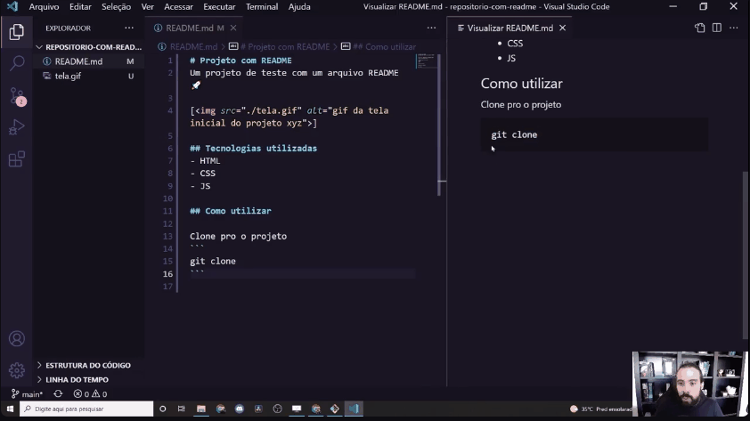

# Projeto com README
Um projeto de texto com arquivo README.

[]

## O que é?
- Não sei
- Não faço ideia
- Já estou ficando com raiva de quem sabe.

## Pra que serve?
- Não entendi
- Não sei
- Não faço ideia

## Como utiliza

Clone pro projeto

```
git clone
```

acessar a pasta


```cd repositorio-com-readme```
